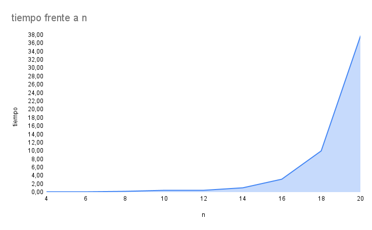

# 📌 Problema: Planeando una fiesta de la compañía

## 🧠 Estrategia

Para resolver el problema mediante fuerza bruta, se aplicó la siguiente estrategia:

1. Se generan todos los subconjuntos posibles del conjunto de empleados. Dado un conjunto de tamaño $$n$$, esto equivale a $$2^n$$ subconjuntos, incluyendo el conjunto vacío y el conjunto total.
2. Antes de almacenar un subconjunto como una combinación válida, se verifica que ningún par de elementos dentro de él tenga una relación directa de subordinación (es decir, que uno sea jefe del otro). Esta relación está representada en una matriz de adyacencia.
3. Si el subconjunto cumple la condición anterior (es "válido"), se almacena en una lista de combinaciones para su posterior análisis.

## 📊 Análisis de Complejidad Temporal

### 🔹 Generación y validación de subconjuntos

- Se generan $$2^n$$ subconjuntos.
- Para cada subconjunto, se realiza una validación que consiste en verificar que no exista una relación directa entre ninguno de sus elementos. Esto implica comparar cada par de elementos del subconjunto, lo cual en el peor caso requiere $$O(n^2)$$ operaciones.
- Por lo tanto, esta parte del algoritmo tiene una complejidad total de:
  $$O(2^n \cdot n^2)$$

### 🔹 Cálculo de valores y ordenamiento

- Luego, se calcula el "valor" o "convivencia" de cada subconjunto válido, sumando los valores asignados a cada nodo (empleado).
- Posteriormente, se ordenan los subconjuntos válidos de mayor a menor valor para seleccionar el que ofrezca el mayor beneficio.
- En el peor caso, todos los subconjuntos son válidos (es decir, $$2^n$$ subconjuntos), y el ordenamiento de estos requiere:
  $$O(2^n \cdot \log_2(2^n)) = O(2^n \cdot n)$$

### 🧮 Complejidad total

Comparando las dos fases del algoritmo:

- Generación y validación: $$O(2^n \cdot n^2)$$
- Cálculo y ordenamiento: $$O(2^n \cdot n)$$

La fase dominante en cuanto a complejidad temporal es la generación y validación, por lo tanto, la **complejidad total del algoritmo es**:

$$O(2^n \cdot n^2)$$

## Análisis de Complejidad Temporal Experimental

Para complementar el análisis teórico, se realizaron múltiples ejecuciones del algoritmo con entradas de distintos tamaños. A partir de estas ejecuciones se registraron los tiempos promedios de ejecución para cada tamaño de entrada, lo que permitió graficar los resultados y observar el comportamiento del algoritmo de forma empírica.

A continuación se muestra la gráfica obtenida:

Esta gráfica permite identificar visualmente cómo crece el tiempo de ejecución en función del tamaño del problema, facilitando así la estimación de su complejidad temporal de forma experimental.

Analizando la gráfica, se puede observar que la complejidad del algoritmo crece de forma exponencial, lo cual concuerda con el análisis teórico realizado previamente.

## Análisis de Complejidad Espacial

El análisis espacial considera la cantidad de memoria utilizada durante la ejecución del algoritmo. En el caso del enfoque de fuerza bruta implementado, los principales factores que influyen en el consumo de memoria son:

### 1. Matriz de adyacencia

La entrada del problema incluye una matriz de adyacencia que representa las relaciones entre los empleados (por ejemplo, jefe-subordinado). Esta matriz es de tamaño \(n \times n\), por lo tanto su complejidad espacial es:

$$
O(n^2)
$$

Este espacio es necesario únicamente para leer y consultar la relación entre nodos. No se modifica ni crece durante la ejecución.

### 2. Arreglo de valores de convivencia

También se recibe como entrada un arreglo de tamaño \(n\), donde cada posición representa la convivencia de un empleado. Este arreglo se mantiene constante y ocupa:

$$
O(n)
$$

### 3. Llamadas recursivas para generar subconjuntos

La generación de subconjuntos se realiza mediante una función recursiva. Aunque el número total de subconjuntos es \(2^n\), la profundidad máxima de la recursión es \(n\), ya que en cada llamada se avanza una posición. Por lo tanto, el espacio de pila necesario para la recursión es:

$$
O(n)
$$

Este espacio se libera conforme se retrocede en el árbol de recursión, por lo que no se acumula exponencialmente.

### 4. Arreglo `combinations` (subconjuntos válidos)

Aquí es donde se acumula la mayor parte del uso de memoria. Por cada subconjunto generado y validado como "válido" (es decir, sin relaciones directas entre sus miembros), se almacena una copia en el arreglo `combinations`. En el peor de los casos, todos los \(2^n\) subconjuntos pueden ser válidos.

Cada subconjunto puede contener hasta \(n\) elementos (en el peor caso, el conjunto completo), así que el espacio ocupado por todos ellos es:

$$
O(2^n \cdot n)
$$

Este componente domina la complejidad espacial total del algoritmo.

---

### Complejidad Espacial Total

Sumando los componentes descritos, obtenemos:

- Matriz de adyacencia: $$O(n^2)$$
- Arreglo de convivencia:$$O(n)$$
- Pila de recursión: $$O(n)$$
- Subconjuntos válidos almacenados: $$O(2^n \cdot n)$$

Por lo tanto, la complejidad espacial total queda dominada por el almacenamiento de subconjuntos válidos:

$$
O(2^n \cdot n)
$$

Este crecimiento exponencial confirma que el enfoque no es viable para valores grandes de \(n\), no solo en tiempo de ejecución sino también en el consumo de memoria.
