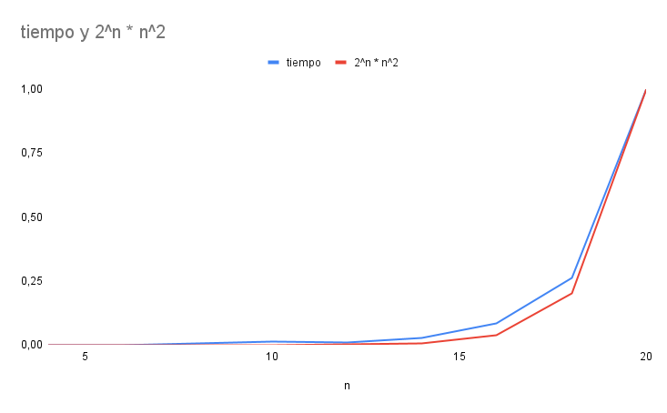

# 📌 Problema: Planeando una fiesta de la compañía

## 🧠 Estrategia

Para resolver el problema mediante fuerza bruta, se aplicó la siguiente estrategia:

1. Se generan todos los subconjuntos posibles del conjunto de empleados. Dado un conjunto de tamaño $$n$$, esto equivale a $$2^n$$ subconjuntos, incluyendo el conjunto vacío y el conjunto total.
2. Antes de almacenar un subconjunto como una combinación válida, se verifica que ningún par de elementos dentro de él tenga una relación directa de subordinación (es decir, que uno sea jefe del otro). Esta relación está representada en una matriz de adyacencia.
3. Si el subconjunto cumple la condición anterior (es "válido"), se almacena en una lista de combinaciones para su posterior análisis.

## 📊 Análisis de Complejidad Temporal

### 🔹 Generación y validación de subconjuntos

- Se generan $$2^n$$ subconjuntos.
- Para cada subconjunto, se realiza una validación que consiste en verificar que no exista una relación directa entre ninguno de sus elementos. Esto implica comparar cada par de elementos del subconjunto, lo cual en el peor caso requiere $$O(n^2)$$ operaciones.
- Por lo tanto, esta parte del algoritmo tiene una complejidad total de:
  $$O(2^n \cdot n^2)$$

### 🔹 Cálculo de valores y ordenamiento

- Luego, se calcula el "valor" o "convivencia" de cada subconjunto válido, sumando los valores asignados a cada nodo (empleado).
- Posteriormente, se ordenan los subconjuntos válidos de mayor a menor valor para seleccionar el que ofrezca el mayor beneficio.
- En el peor caso, todos los subconjuntos son válidos (es decir, $$2^n$$ subconjuntos), y el ordenamiento de estos requiere:
  $$O(2^n \cdot \log_2(2^n)) = O(2^n \cdot n)$$

### 🧮 Complejidad total

Comparando las dos fases del algoritmo:

- Generación y validación: $$O(2^n \cdot n^2)$$
- Cálculo y ordenamiento: $$O(2^n \cdot n)$$

La fase dominante en cuanto a complejidad temporal es la generación y validación, por lo tanto, la **complejidad total del algoritmo es**:

$$O(2^n \cdot n^2)$$

## Análisis de Complejidad Temporal Experimental

Para complementar el análisis teórico, se realizaron múltiples ejecuciones del algoritmo con entradas de distintos tamaños. A partir de estas ejecuciones se registraron los tiempos promedios de ejecución para cada tamaño de entrada, lo que permitió graficar los resultados y observar el comportamiento del algoritmo de forma empírica.

A continuación se muestra la gráfica obtenida:

Esta gráfica permite identificar visualmente cómo crece el tiempo de ejecución en función del tamaño del problema, facilitando así la estimación de su complejidad temporal de forma experimental.

Analizando la gráfica, se puede observar que la complejidad del algoritmo crece de forma exponencial, lo cual concuerda con el análisis teórico realizado previamente.
