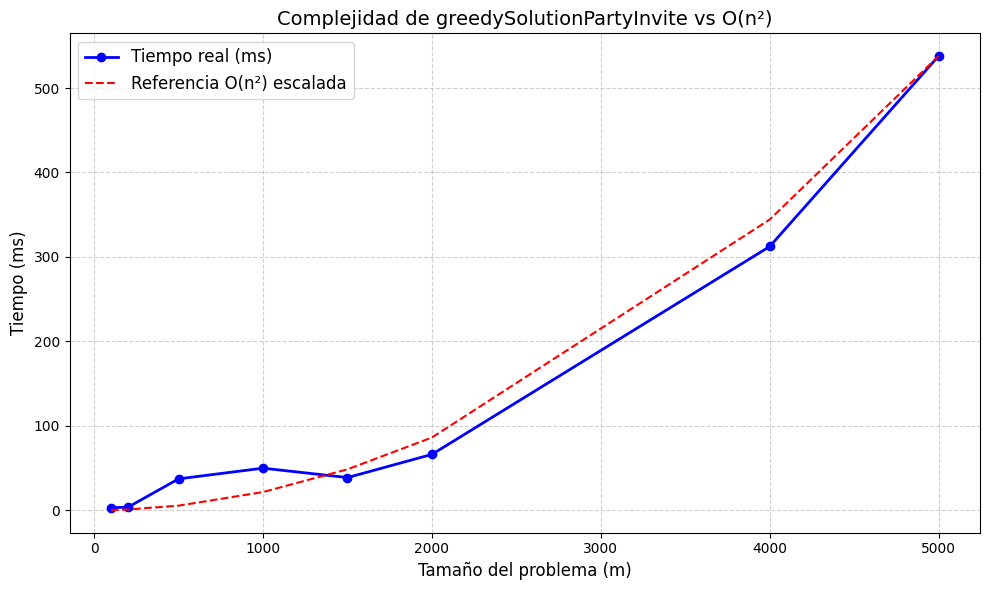

# Solución voraz al problema: Planeando una fiesta de la compañía

## Estrategia utilizada

Para resolver el problema de planear una fiesta maximizando la **convivencia**, sin invitar al mismo tiempo a empleados que sean jefe y subordinado directo, se aplicó una **estrategia voraz**. Esta estrategia permite tomar decisiones rápidas y eficientes para obtener una solución aproximada óptima, aprovechando ciertas estructuras de datos para optimizar las consultas y elecciones durante el proceso.

### Transformación de matriz de adyacencia a listas jerárquicas

Inicialmente, el problema proporciona una matriz de adyacencia que representa las relaciones entre empleados: si `matrix[i][j] === 1`, entonces el empleado `i` es jefe directo de `j`. Sin embargo, recorrer constantemente una matriz de adyacencia puede ser ineficiente cuando buscamos relaciones jerárquicas directas.

Por esta razón, convertimos la matriz en **dos listas jerárquicas**:

- **`hijos[i]`**: Lista de subordinados directos del empleado `i`.
- **`padres[i]`**: Lista de jefes directos del empleado `i`.

Esto permite consultas rápidas y directas sobre si un empleado tiene un jefe o subordinado ya invitado, lo cual es clave para aplicar la estrategia voraz. Esta transformación mejora la legibilidad del código y reduce la complejidad de búsqueda de relaciones jerárquicas de O(n²) a O(n).

### Ordenamiento de candidatos por convivencia

Luego, se ordenan los empleados en una lista de **candidatos**, de mayor a menor según su **valor de convivencia**. Este ordenamiento es fundamental en una estrategia voraz, ya que siempre se intenta tomar primero el elemento más prometedor (es decir, con mayor beneficio), sin considerar consecuencias futuras complejas.

### Aplicación de la estrategia voraz

Con la lista ordenada, se procede a seleccionar a los empleados utilizando la siguiente lógica:

- Se recorre cada candidato en orden de mayor a menor convivencia.
- Para cada candidato `i`, se verifica si algún subordinado directo o jefe directo ya ha sido invitado. Si ninguno lo ha sido, se invita a este empleado.
- Si se detecta conflicto jerárquico (es decir, ya hay un jefe o subordinado invitado), se descarta al candidato para evitar violar la restricción.

Este enfoque asegura que se elijan empleados con la mayor convivencia posible, sin violar la regla de jerarquía.

# Análisis de complejidad del algoritmo `greedySolutionPartyInvite`

---

## 1. Loop principal (`for (let idx = 0; idx < n; idx++)`)
- **Complejidad temporal:** `O(n)`
- Se ejecuta una vez por cada uno de los `n` problemas.
- **Complejidad espacial:** `O(n · m)`
  - Se genera un resultado por problema, donde se almacena un arreglo `invitados` de tamaño `m` y un número total.

---

## 2. Inicialización de arreglos (`invitados`, `hijos`, `padres`)
- **Complejidad temporal:** `O(m)`
- Se crean tres arreglos de tamaño `m` para cada persona en el problema actual.
- **Complejidad espacial:** 
  - `invitados`: `O(m)`
  - `hijos` y `padres`: `O(m)` para la estructura base (arreglos vacíos)

---

## 3. Conversión de matriz a listas de adyacencia (`hijos`, `padres`)
- **Complejidad temporal:** `O(m²)`
  - Dos bucles anidados recorren la matriz `m x m` para convertirla en listas.
- **Complejidad espacial:** `O(m²)`
  - En el peor caso (matriz densa), cada persona puede estar conectada con todas las demás.
  - Por tanto, las listas de `hijos[i]` y `padres[i]` pueden tener hasta `m` elementos cada una.

---

## 4. Ordenamiento de candidatos (`candidatos.sort`)
- **Complejidad temporal:** `O(m log m)`
  - Se ordena un arreglo de `m` elementos.
- **Complejidad espacial:** `O(m)`
  - Se crea un arreglo adicional con los objetos `{ i, calif }` para cada persona.

---

## 5. Selección greedy de invitados
- **Complejidad temporal:** `O(m²)` en el peor caso
  - Por cada uno de los `m` candidatos se verifica que ni sus jefes ni sus subordinados estén invitados.
  - Cada una de esas listas (`hijos[i]`, `padres[i]`) puede tener hasta `m` elementos.
- **Complejidad espacial:** no se utilizan nuevas estructuras; se opera sobre `invitados`, `hijos`, y `padres`.

---

## 6. Cálculo del total (`invitados.reduce`)
- **Complejidad temporal:** `O(m)`
  - Se recorre el arreglo `invitados` una vez.
- **Complejidad espacial:** `O(1)`
  - Solo se utiliza una variable acumuladora.

---

## Resumen de complejidades por paso (por problema)

| Paso                         | Complejidad Temporal | Complejidad Espacial |
|------------------------------|----------------------|----------------------|
| Inicialización de estructuras | `O(m)`               | `O(m)`               |
| Conversión matriz → listas    | `O(m²)`              | `O(m²)`              |
| Ordenamiento                 | `O(m log m)`         | `O(m)`               |
| Selección greedy             | `O(m²)`              | `O(1)`               |
| Cálculo del total            | `O(m)`               | `O(1)`               |

---

## Complejidad total

### Temporal
- Por problema: `O(m²)` (dominado por conversión y selección).
- Para `n` problemas: `O(n · m²)` (si todos de tamaño `m`), o bien:
  \[
  O\left(\sum_{i=1}^{n} m_i^2\right)
  \]

### Espacial
- Por problema: `O(m²)`
  - Dominado por el almacenamiento de listas `hijos` y `padres`.
- Para `n` problemas: `O(n · m²)`, o bien:
  \[
  O\left(\sum_{i=1}^{n} m_i^2\right)
  \]

---

## Análisis de Complejidad Temporal Experimental

Se realizaron múltiples ejecuciones del algoritmo con diferentes tamaños de entrada: 10, 50, 100, 400, 700, 1000, 3000 y 5000. Estos tamaños fueron seleccionados teniendo en cuenta el máximo valor que soporta el equipo de pruebas sin comprometer la estabilidad del sistema.

Por otro lado, se realizó la comparación gráfica entre la curva de tiempos de ejecución del algoritmo (representada en color azul) y la función cuadrática $$O(n^2)$$ (representada en color rojo). Se puede evidenciar cómo ambas presentan un comportamiento similar, con algunas variaciones que pueden deberse a factores externos como la carga del sistema, el recolector de basura del entorno de ejecución u otros procesos corriendo en segundo plano.

En general, los resultados experimentales confirman la hipótesis teórica de que el algoritmo presenta una complejidad de tipo cuadrática. A continuación, se muestra la gráfica que evidencia esta comparación:

## Conclusión

- **El algoritmo es cuadrático** en el tamaño de cada problema (`m`) tanto en tiempo como en espacio.
- El paso más costoso es la conversión de la matriz a listas y la verificación greedy.
- En escenarios donde `m` es grande o la matriz es densa, el rendimiento puede verse afectado.
- Se podría optimizar el uso de memoria si se trabaja problema por problema sin acumular resultados, o si se utiliza una representación más eficiente para grafos dispersos.

