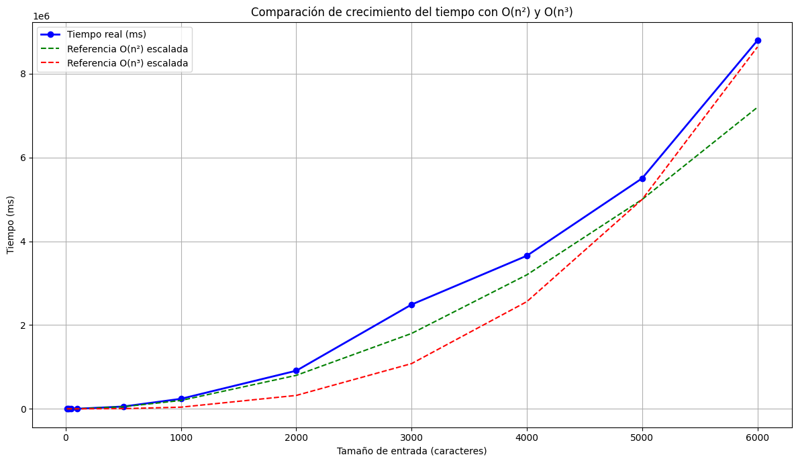

# Solución Fuerza Bruta: Palíndromo Más Largo en un Texto

## Estrategia General

El objetivo de este algoritmo es encontrar la **subcadena palindrómica más larga** dentro de un texto de entrada. Se implementa una solución de **fuerza bruta**, que examina todas las posibles subcadenas y verifica cuáles son palíndromos, seleccionando la de mayor longitud.

El algoritmo se divide en tres partes principales:

---

### 1. Normalización del texto

Antes de buscar palíndromos, se limpia el texto de entrada con la función `normalizeString`, que:

- Convierte todo a minúsculas.
- Reemplaza caracteres acentuados por su versión sin tilde (`áàäâ → a`, etc.).
- Elimina caracteres no alfanuméricos, excepto la letra `ñ` y los números (`[^a-z0-9ñ]`).

Esto permite evaluar palíndromos de forma uniforme, ignorando mayúsculas, tildes y signos de puntuación.

---

### 2. Generación de todas las subcadenas posibles

Se utilizan dos bucles anidados para generar todas las subcadenas del texto normalizado:

- `i` marca el inicio de la subcadena.
- `j` marca el final (no inclusivo).
- La subcadena se construye con `normalizedInput.slice(i, j)`.

Se usa `j > i` para evitar subcadenas vacías. Por ejemplo, si `i = j`, `slice(i, j)` devuelve `""`, lo cual no es útil para nuestra búsqueda.

---

### 3. Verificación de palíndromos

Cada subcadena generada es verificada con la función `isPalindrome`, que:

- Compara el primer carácter con el último, el segundo con el penúltimo, y así sucesivamente.
- Devuelve `false` al encontrar el primer desajuste.
- Si completa todo el ciclo sin errores, la subcadena es palíndroma.

Si la subcadena es palíndroma **y** su longitud es mayor que la del palíndromo más largo encontrado hasta ese momento, se actualiza la variable `longestPalindrome`.

## Complejidad Temporal y Espacial

### 1. Función `normalizeString(str)`

**Complejidad Temporal:**
- `.toLowerCase()`: `O(n)` (recorre toda la cadena).
- `.replace()` (6 veces): Cada `replace` recorre la cadena (`O(n)` por operación).

**Total:** `O(6n) = O(n)` (se ignoran las constantes en la notación Big-O).

**Complejidad Espacial:**
- `.toLowerCase()` → nueva cadena (`O(n)`).
- Cada `.replace()` → genera una nueva cadena (`O(n)` por operación).

**Total:** `O(n)` (se reutiliza espacio, no se acumula).

---

### 2. Función `isPalindrome(str)`

**Complejidad Temporal:**
- Peor caso: `O(n)` (recorre hasta la mitad de la cadena).
- Mejor caso: `O(1)` (si el primer y último carácter no coinciden).

**Complejidad Espacial:** `O(1)` (no usa estructuras adicionales, solo índices).

---

### 3. Función `isPalindromeBruteForce(input)`

**Complejidad Temporal:**
- Normalización (`normalizeString`): `O(n)`.
- Bucle anidado para generar subcadenas:
  - Bucle externo (`i`): `O(n)` iteraciones.
  - Bucle interno (`j`): `O(n)` iteraciones en el peor caso.
  - **Total de subcadenas generadas:** `O(n²)`.
- Verificación de palíndromo (`isPalindrome`) para cada subcadena:
  - Longitud promedio del substring: `O(k)`, donde `k` es el tamaño del substring.
  - En el peor caso, `k = n` (cuando `i = 0` y `j = n`).

**Total:** `O(n² · n) = O(n³)` (peor caso).

**Complejidad Espacial:**
- `normalizedInput`: `O(n)` (cadena normalizada).
- `longestPalindrome`: `O(n)` (en el peor caso, almacena toda la cadena).
- Subcadenas (`substring`): Cada `.slice(i, j)` crea una nueva cadena (`O(k)`).
  - En el peor caso, esto puede llegar a `O(n²)` si se almacenan muchas subcadenas (aunque en este caso no se acumulan).

**Total:** `O(n)` (solo se mantiene `longestPalindrome` en memoria).

---

### Resumen Final

| Función                        | Complejidad Temporal      | Complejidad Espacial      |
|---------------------------------|---------------------------|---------------------------|
| `normalizeString(str)`          | `O(n)`                    | `O(n)`                    |
| `isPalindrome(str)`             | `O(n)`                    | `O(1)`                    |
| `isPalindromeBruteForce(input)` | `O(n³)` (peor caso)       | `O(n)`                    |

---

### Explicación Detallada

La función `isPalindromeBruteForce` es la más costosa debido a su enfoque de fuerza bruta:

1. Genera todas las posibles subcadenas (`O(n²)`).
2. Para cada una, verifica si es palíndromo (`O(n)` por subcadena).

**Total:** `O(n³)` en el peor caso (por ejemplo, con la entrada "aaa...aaa").

La complejidad espacial es lineal (`O(n)`), ya que no se almacenan todas las subcadenas, solo la más larga.

---

### Análisis de Complejidad Temporal Experimental

Se realizaron múltiples ejecuciones del algoritmo con diferentes tamaños de entrada: 100, 500, 1000, 2000, 3000, 4000 y 5000. Estos tamaños fueron seleccionados teniendo en cuenta el máximo valor que soporta el equipo de pruebas sin comprometer la estabilidad del sistema.

La gráfica muestra el tiempo de ejecución (La linea azul) de la solución de fuerza bruta para encontrar el palíndromo más largo en función del tamaño del problema (m). Se compara con una referencia teórica de complejidad O(n³) escalada (La linea roja). Se puede evidenciar cómo ambas presentan un comportamiento similar, con algunas variaciones que pueden deberse a factores externos como la carga del sistema, el recolector de basura del entorno de ejecución u otros procesos corriendo en segundo plano.

