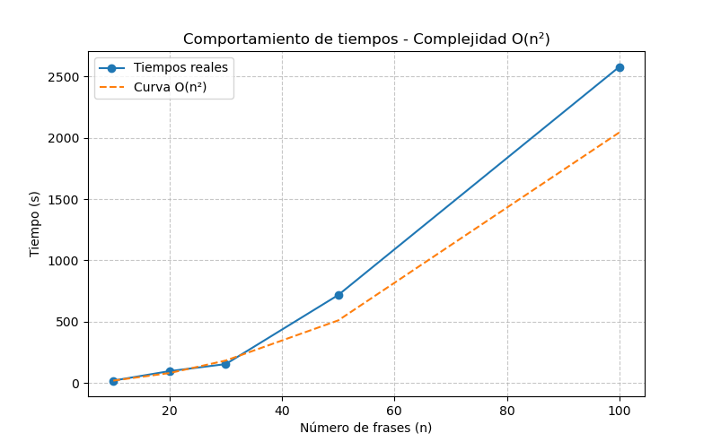

# Informe: Solución de Programación Dinámica para Palíndromo Más Largo

## Estrategia General

El objetivo de este algoritmo es encontrar la subcadena palindrómica más larga dentro de un texto de entrada utilizando un enfoque de **Programación Dinámica**. A diferencia de la solución de fuerza bruta, esta técnica optimiza el proceso al evitar recalcular subproblemas repetidos, mejorando significativamente la eficiencia.

## Estructura del Algoritmo

El algoritmo se divide en los siguientes pasos principales:

### 1. Normalización del Texto

Antes de buscar palíndromos, se limpia el texto de entrada mediante una función llamada `normalizeString`, que:

* Convierte todo el texto a minúsculas.
* Reemplaza caracteres acentuados por su versión sin tilde (áàäâ → a, etc.).
* Elimina caracteres no alfanuméricos, exceptuando los números.

De esta forma, se garantiza que la comparación de subcadenas sea uniforme e independiente de mayúsculas, tildes o signos de puntuación.

#### Código de Normalización

```javascript
function normalizeString(str) {
    return str
        .toLowerCase()
        .replace(/[áàäâ]/g, 'a')
        .replace(/[éèëê]/g, 'e')
        .replace(/[íìïî]/g, 'i')
        .replace(/[óòöô]/g, 'o')
        .replace(/[úùüû]/g, 'u')
        .replace(/[^a-z0-9]/g, '');
}
```

### 2. Inicialización de la Tabla DP

Se crea una tabla de programación dinámica (`dp`) para almacenar información sobre las subcadenas palindrómicas:

* `dp[i][j]` es `true` si la subcadena desde el índice `i` hasta el índice `j` es un palíndromo.
* Se inicializan todos los palíndromos de un solo carácter como verdaderos (`dp[i][i] = true`).

#### Código de Inicialización

```javascript
const n = normalized.length;
const dp = Array.from({ length: n }, () => Array(n).fill(false));

// Subcadenas de un solo carácter son palíndromos
for (let i = 0; i < n; i++) {
    dp[i][i] = true;
}
```

### 3. Expansión de Subcadenas

El algoritmo:

* Recorre todas las posibles subcadenas de longitud 2 y marca como palíndromos aquellas en las que ambos caracteres son iguales.
* Luego, recorre todas las subcadenas de longitud mayor a 2, verificando:

  * Si el primer y último carácter son iguales.
  * Si la subcadena interna también es un palíndromo (`dp[i + 1][j - 1]`).

Si se cumplen ambas condiciones, se marca `dp[i][j]` como `true` y se actualizan los valores de inicio y longitud del palíndromo más largo encontrado.

#### Código de Expansión

```javascript
let maxLength = 1;
let start = 0;

// Subcadenas de longitud 2
for (let i = 0; i < n - 1; i++) {
    if (normalized[i] === normalized[i + 1]) {
        dp[i][i + 1] = true;
        start = i;
        maxLength = 2;
    }
}

// Subcadenas de longitud mayor a 2
for (let length = 3; length <= n; length++) {
    for (let i = 0; i <= n - length; i++) {
        const j = i + length - 1;

        if (normalized[i] === normalized[j] && dp[i + 1][j - 1]) {
            dp[i][j] = true;
            start = i;
            maxLength = length;
        }
    }
}
```

### 4. Identificación del Palíndromo Más Largo

Al final del recorrido, se utiliza la posición `start` y la longitud `maxLength` para extraer la subcadena palindrómica más larga.

#### Código para Extraer el Palíndromo

```javascript
const longestPalindrome = normalized.slice(start, start + maxLength);
```

---

## Complejidad Temporal y Espacial

| Función                 | Complejidad Temporal | Complejidad Espacial |
| ----------------------- | -------------------- | -------------------- |
| `normalizeString`       | O(n)                 | O(n)                 |
| Generación de DP        | O(n²)                | O(n²)                |
| Expansión de Subcadenas | O(n²)                | O(n²)                |

**Complejidad Total:** O(n²)

---

## Análisis de Complejidad Temporal Experimental

Se realizaron múltiples ejecuciones del algoritmo con diferentes tamaños de entrada: `10, 20, 30, 50, 100, 500, 1000`. Estos tamaños fueron seleccionados teniendo en cuenta el máximo valor que soporta el equipo de pruebas sin comprometer la estabilidad del sistema.

A continuación, se incluye un espacio para las gráficas generadas durante las pruebas:





---

## Conclusión

El enfoque de Programación Dinámica para encontrar el palíndromo más largo mejora considerablemente el rendimiento en comparación con la solución de fuerza bruta, al reducir la complejidad temporal de O(n³) a O(n²). Además, el uso de una tabla de subproblemas permite identificar de manera eficiente las subcadenas palindrómicas, optimizando tanto tiempo de ejecución como el uso de memoria.

---

