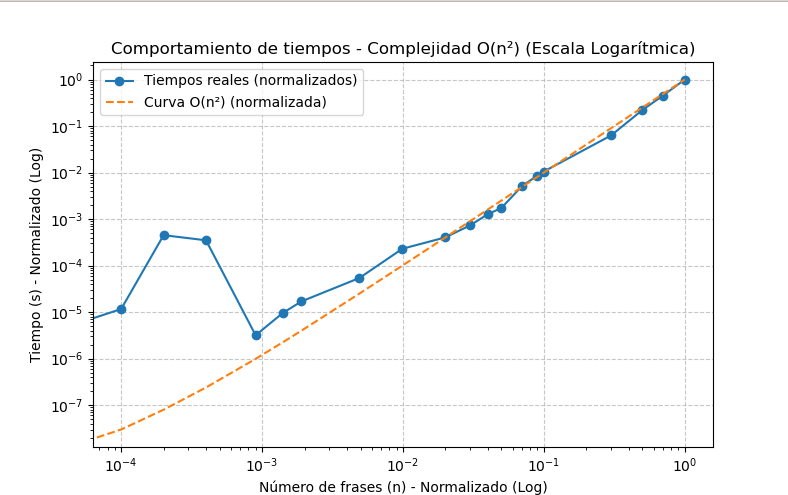

# Informe: Solución Voraz para Palíndromo Más Largo

## Estrategia General

El objetivo de este algoritmo es encontrar una **subsecuencia palindrómica** más larga dentro de un texto de entrada utilizando un enfoque de **búsqueda voraz**. A diferencia de la programación dinámica o fuerza bruta, este método se centra en encontrar coincidencias progresivas en los extremos de la cadena, intentando construir un palíndromo de manera iterativa.

## Estructura del Algoritmo

El algoritmo se divide en los siguientes pasos principales:

### 1. Normalización del Texto

Antes de buscar palíndromos, se limpia el texto de entrada mediante una función llamada `normalizarCadena`, que:

* Convierte todo el texto a minúsculas.
* Reemplaza caracteres acentuados por su versión sin tilde (áàäâ → a, etc.).
* Elimina caracteres no alfanuméricos.

De esta forma, se garantiza que la comparación de subcadenas sea uniforme e independiente de mayúsculas, tildes o signos de puntuación.

#### Código de Normalización

```javascript
function normalizarCadena (cadena) {
  return cadena
      .toLowerCase()
      .replace(/[áàäâ]/g, 'a')
      .replace(/[éèëê]/g, 'e')
      .replace(/[íìïî]/g, 'i')
      .replace(/[óòöô]/g, 'o')
      .replace(/[úùüû]/g, 'u')
      .replace(/[^a-z0-9]/g, ''); // Elimina todo lo que no sea alfanumérico
}
```

### 2. Búsqueda Voraz de Subsecuencia Palindrómica

En este paso, el algoritmo:

* Define dos punteros `i` y `j` para representar los extremos de la cadena.
* Intenta encontrar coincidencias en ambos extremos.
* Si encuentra una coincidencia, se agrega al inicio y al final de dos listas (`inicio` y `fin`).
* En caso contrario, aplica una búsqueda hacia el centro para encontrar el siguiente par coincidente.
* Si no se encuentra, simplemente avanza los punteros hasta la siguiente posición.

#### Código de Búsqueda Voraz

```javascript
function encontrarSubsecuenciaVoraz(normalizada) {
  let i = 0;
  let j = normalizada.length - 1;
  let inicio = [];
  let fin = [];

  while (i <= j) {
    if (normalizada[i] === normalizada[j]) {
      inicio.push(normalizada[i]);
      if (i !== j) fin.unshift(normalizada[j]);
      i++;
      j--;
    } else {
      let encontrado = false;

      for (let k = j - 1; k > i; k--) {
        if (normalizada[i] === normalizada[k]) {
          j = k;
          encontrado = true;
          break;
        }
      }

      if (!encontrado) {
        for (let k = i + 1; k < j; k++) {
          if (normalizada[k] === normalizada[j]) {
            i = k;
            encontrado = true;
            break;
          }
        }
      }

      if (!encontrado) {
        i++;
        j--;
      }
    }
  }

  return inicio.concat(fin).join('');
}
```

### 3. Función Principal

La función principal `encontrarPalindromoVoraz` se encarga de:

* Normalizar la cadena de entrada.
* Llamar al método voraz para encontrar la subsecuencia palindrómica.
* Retornar el resultado encontrado.

#### Código de la Función Principal

```javascript
function encontrarPalindromoVoraz(cadena) {
  const normalizada = normalizarCadena(cadena);
  return encontrarSubsecuenciaVoraz(normalizada);
}
```

---

## Complejidad Temporal y Espacial

| Función                      | Complejidad Temporal | Complejidad Espacial |
| ---------------------------- | -------------------- | -------------------- |
| `normalizarCadena`           | O(n)                 | O(n)                 |
| `encontrarSubsecuenciaVoraz` | O(n²)                | O(n)                 |
| `encontrarPalindromoVoraz`   | O(n²)                | O(n)                 |

**Complejidad Total:** O(n²)

El enfoque voraz no garantiza el palíndromo más largo, pero encuentra uno válido en menor tiempo que la fuerza bruta y con menor uso de memoria que la programación dinámica.

---

## Análisis de Complejidad Temporal Experimental

Se realizaron múltiples ejecuciones del algoritmo con diferentes tamaños de entrada: `10, 20, 30, 50, 100, 500, 1000`. Estos tamaños fueron seleccionados teniendo en cuenta el máximo valor que soporta el equipo de pruebas sin comprometer la estabilidad del sistema.

A continuación, se incluye un espacio para las gráficas generadas durante las pruebas:

```



---

## Conclusión

El enfoque voraz permite encontrar subsecuencias palindrómicas de forma eficiente, aunque no siempre garantiza la más larga posible. Sin embargo, su complejidad O(n²) lo hace una opción razonable para entradas moderadamente grandes.

---
